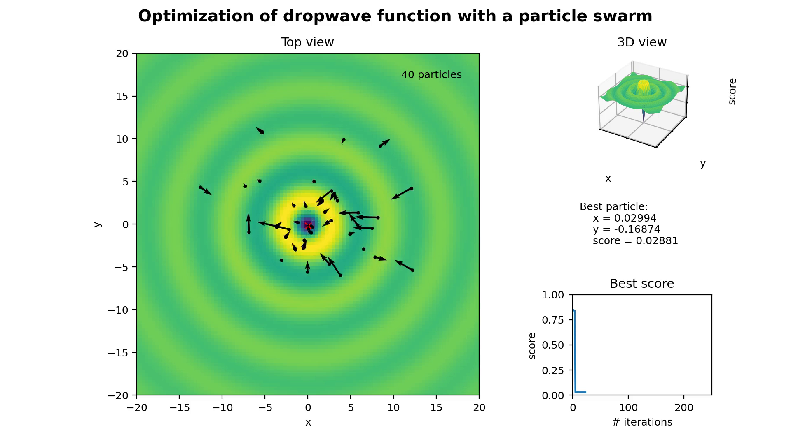

# PSO-ANN

[](https://github.com/kuhess/pso-ann/actions/workflows/main.yml)

Small project to try Particle Swarm Optimization to optimize an Artificial Neural Network.



## Run the examples

You can find examples as standalone projects in [`examples`](./examples/).

For instance, if you want to clone the repository and run the animation example, you can do:

```
git clone git@github.com:kuhess/pso-ann.git
poetry install
cd examples/animation
poetry install
poetry run python animation.py
```

## Run the tests

```
poetry run pytest
```

## Resources

- https://en.wikipedia.org/wiki/Particle_swarm_optimization
- https://en.wikipedia.org/wiki/Artificial_neural_network

I made a quick presentation in French for the Dat'Apéro meetup in Angers (https://github.com/kuhess/pso-ann-datapero). Note that it contains just the slides of the presentation.
